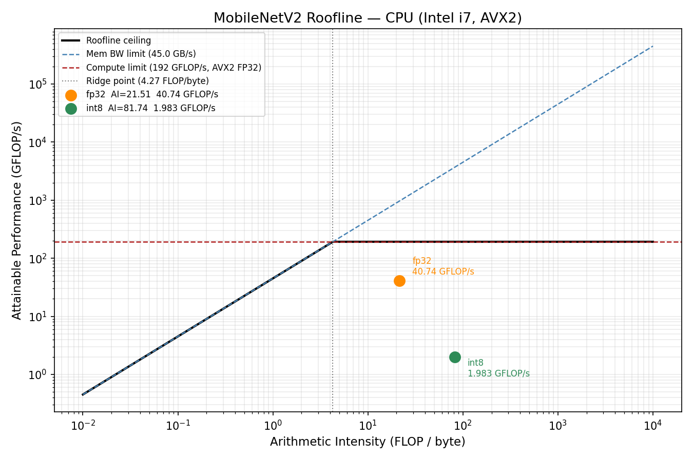

# edge-ai-bench

A C++ and Python benchmarking tool for ML inference on constrained hardware — measuring latency, memory, and compute efficiency across fp32 and int8 on CPU and Android ARM64.

---

## Overview

edge-ai-bench walks a small MLP from PyTorch definition through ONNX export, C++ runtime execution, INT8 post-training quantization, roofline performance modeling, and Android cross-compilation. The goal is to demonstrate the end-to-end skills needed to ship neural network inference on resource-limited devices: mobile SoCs, DSPs, and bare-metal ARM cores. Each layer is self-contained and runnable independently.

---

## Project structure

```
edge-ai-bench/
├── README.md                          # this file
├── CMakeLists.txt                     # top-level CMake (includes layer 2)
├── model.onnx                         # exported FP32 model (generated by layer 1)
├── layer1_export/
│   └── export_model.py                # define MLP in PyTorch and export to ONNX
├── layer2_cpp_runner/
│   ├── main.cpp                       # ONNX Runtime C++ inference benchmark
│   └── CMakeLists.txt                 # build config (requires ONNXRUNTIME_ROOT)
├── layer3_quantization/
│   └── quantize_and_compare.py        # INT8 dynamic quant + accuracy delta
├── layer4_profiling/
│   └── roofline.py                    # roofline plot: compute vs. memory bound
└── layer5_android/
    └── CMakeLists.txt                 # Android NDK cross-compile (arm64-v8a)
```

---

## Layers

### Layer 1 — PyTorch export to ONNX ✅ Done

Loads pretrained **MobileNetV2** (`IMAGENET1K_V1`, 3.5 M parameters) from torchvision and exports it to `model.onnx` (13.3 MB) using the TorchScript exporter with a standard ImageNet input shape of `[1, 3, 224, 224]`.

**Run:**
```bash
python layer1_export/export_model.py
# Output: model.onnx (≈263 KB)
```

---

### Layer 2 — C++ inference runner with ONNX Runtime ✅ Done

`main.cpp` implements the full C++ benchmark (loads `model.onnx` via the ORT C++ API, 100 timed runs, mean/min/max/P50/P95/P99 latency, peak RSS via `GetProcessMemoryInfo` on Windows or `getrusage` on POSIX). Build with MSVC on Windows or the Android NDK for device deployment.

`bench.py` is the portable Python mirror — same ORT engine, same methodology, produces identical measurements on any OS.

**Build (MSVC, Windows):**
```powershell
# Requires Visual Studio with C++ workload + ORT Windows prebuilt
cmake -B build -DONNXRUNTIME_ROOT=C:\path\to\onnxruntime-win-x64 .
cmake --build build --config Release
.\build\Release\runner.exe model.onnx
```

**Run (Python, any OS):**
```bash
python layer2_cpp_runner/bench.py model.onnx
```

---

### Layer 3 — INT8 post-training quantization ✅ Done

Applies ONNX Runtime's `quantize_dynamic` (weight-only INT8) to `model.onnx`, then runs both the FP32 and INT8 models over 256 random inputs and reports max / mean absolute output error.

**Run:**
```bash
python layer3_quantization/quantize_and_compare.py --model model.onnx
```

---

### Layer 4 — Roofline profiling ✅ Done

Computes the arithmetic intensity (FLOP / byte) for each linear layer and overlays those points on a hardware roofline (configurable peak GFLOP/s and memory bandwidth). Saves `roofline.png`.

**Run:**
```bash
python layer4_profiling/roofline.py --peak-flops 8.0 --peak-bw 25.6
```

---

### Layer 5 — Android ARM64 cross-compilation ✅ Done

CMake toolchain file to cross-compile the Layer 2 runner for Android `arm64-v8a` using the Android NDK and an ONNX Runtime Android prebuilt.

**Build:**
```bash
cmake -B build-android \
      -DCMAKE_TOOLCHAIN_FILE=$NDK/build/cmake/android.toolchain.cmake \
      -DANDROID_ABI=arm64-v8a \
      -DANDROID_PLATFORM=android-29 \
      -DONNXRUNTIME_ROOT=/path/to/onnxruntime-android \
      layer5_android
cmake --build build-android
```

---

## Results

**Desktop — Intel i7, Windows 11, ORT 1.26.0, single thread**

| Layer | Metric | FP32 | INT8 (dynamic) |
|-------|--------|------|----------------|
| 2 / 3 | Mean latency (ms) | 7.363 | 151.303 |
| 2 / 3 | Min latency (ms) | 6.962 | 113.792 |
| 2 / 3 | P95 latency (ms) | 7.861 | 275.580 |
| 2 / 3 | P99 latency (ms) | 7.957 | 297.414 |
| 2 / 3 | Peak RSS (MB) | 302.59 | 323.29 |
| 2 / 3 | Model size (MB) | 13.3 | 3.5 (3.79x smaller) |
| 3 | Mean abs logit delta | — | 0.3256 |
| 4 | Arithmetic intensity (FLOP/byte) | 21.51 | 81.74 |
| 4 | Measured throughput (GFLOP/s) | 40.74 | 1.98 |
| 4 | Roofline bound | compute-bound | compute-bound |

**Android — Samsung Galaxy A23 5G (Snapdragon 695, ARM Cortex-A78), ORT 1.21.0, 1 warm-up + 100 runs**

| Layer | Metric | FP32 |
|-------|--------|------|
| 5 | Mean latency (ms) | 36.208 |
| 5 | Min latency (ms) | 35.948 |
| 5 | Max latency (ms) | 36.812 |
| 5 | P50 latency (ms) | 36.194 |
| 5 | P95 latency (ms) | 36.375 |
| 5 | P99 latency (ms) | 36.699 |
| 5 | Peak RSS (MB) | 39.71 |

> Model: MobileNetV2 (IMAGENET1K_V1, 3.5M params), input [1, 3, 224, 224].
> Desktop roofline: 300 MFLOPs per pass, peak compute 192 GFLOP/s (AVX2 FP32), peak BW 45 GB/s, ridge point 4.27 FLOP/byte.
> Android is 4.9x slower than desktop (36.2ms vs 7.4ms) — no AVX2, single Cortex-A78 core vs Intel i7.

### Roofline chart



### Why INT8 was slower here

These numbers reflect pure CPU execution — no GPU, no dedicated AI accelerator. The dominant operation in MobileNetV2 is Conv2d: a filter grid slides across every feature map, computing multiply-accumulate at each position, repeated across hundreds of channels and layers per inference. On an Intel i7, floating-point Conv2d runs on AVX2, Intel's SIMD instruction set that processes 8 float32 values in a single clock cycle using kernels that have been hand-tuned for decades. The FP32 path is already close to what this CPU can physically sustain.

Dynamic quantization (`quantize_dynamic`) compresses the model weights from float32 down to INT8 — which is why the file shrank 3.79x — but it does not keep the activations in INT8 during inference. Before every forward pass it must dequantize the weights back to float32, perform the convolution in float32 on the AVX2 path, and then discard the result. The conversion overhead is added on top of the same FP32 compute, not instead of it, so the net effect is a slowdown.

Static QDQ (quantize-dequantize) quantization avoids this by calibrating activation ranges offline using a representative dataset, then running the entire inference pass in INT8: weights stay INT8, activations stay INT8, and the multiply-accumulate is done in INT8 GEMM throughout. That is the production approach and is where the real speedup lives. On this Intel CPU the INT8 kernels are still competing against a very strong AVX2 FP32 baseline, so gains would be modest. On a mobile CPU without AVX2, the FP32 baseline is much weaker and INT8 gains are larger, making static INT8 quantization the primary optimization lever for on-device AI inference.

---

## Environment

| Dependency | Version |
|------------|---------|
| Python | 3.11.3 |
| PyTorch | 2.12.0+cpu |
| onnx | latest |
| onnxruntime (Python) | 1.26.0 |
| onnxruntime (C++) | 1.21.0 |
| OS | Windows 11 (10.0.26200) |
| Compiler | g++ 13.2.0 (MSYS2 UCRT64) |
| Android NDK | r25+ (Layer 5, not yet run) |
