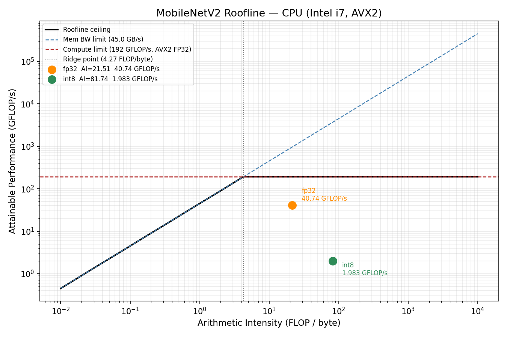

# edge-ai-bench

End-to-end benchmarking of MobileNetV2 inference across fp32 and int8, on an Intel i7 desktop and a Snapdragon 695 Android phone. Each layer is self-contained and runnable independently.

---

## Project structure

```
edge-ai-bench/
├── README.md
├── CMakeLists.txt                     # top-level CMake, includes layer2_cpp_runner
├── model.onnx                         # fp32 MobileNetV2, generated by layer 1
├── layer1_export/
│   └── export_model.py                # export pretrained MobileNetV2 to ONNX
├── layer2_cpp_runner/
│   ├── main.cpp                       # C++ inference benchmark via ORT C++ API
│   ├── bench.py                       # Python equivalent, runs on any OS
│   └── CMakeLists.txt                 # requires ONNXRUNTIME_ROOT
├── layer3_quantization/
│   ├── quantize_and_compare.py        # INT8 dynamic quantization + latency comparison
│   └── quantize_static.py             # INT8 static QDQ quantization (for Android; dynamic INT8 doesn't run there)
├── layer4_profiling/
│   ├── roofline.py                    # roofline model plot (desktop, AVX2)
│   └── roofline_phone.py              # roofline model plot (phone, NEON)
└── layer5_android/
    ├── CMakeLists.txt                 # Android NDK cross-compile for arm64-v8a
    └── runner_android                 # prebuilt binary (Snapdragon 695, android-29)
```

---

## Layers

### Layer 1 — Export to ONNX (complete)

Loads pretrained MobileNetV2 (IMAGENET1K_V1, 3.5M parameters) from torchvision and exports to `model.onnx` (13.3 MB) using the TorchScript exporter. Input shape `[1, 3, 224, 224]`.

```bash
python layer1_export/export_model.py
```

---

### Layer 2 — C++ inference runner (complete)

`main.cpp` loads `model.onnx` via the ORT C++ API, runs 1 warm-up pass then 100 timed passes, and reports mean/min/max/P50/P95/P99 latency and peak RSS. Memory reporting uses `GetProcessMemoryInfo` on Windows and `getrusage` on POSIX, so the same binary works on Android.

`bench.py` is a Python port using the same ORT session options and timing methodology. Useful for quick runs without a C++ toolchain.

Build with MSVC on Windows:
```powershell
cmake -B build -DONNXRUNTIME_ROOT=C:\path\to\onnxruntime-win-x64 .
cmake --build build --config Release
.\build\Release\runner.exe model.onnx
```

Run the Python version on any OS:
```bash
python layer2_cpp_runner/bench.py model.onnx
```

---

### Layer 3 — INT8 quantization (complete)

Applies `quantize_dynamic` (weight-only INT8) to `model.onnx`, producing `model_int8.onnx`. Runs both models over 100 inputs with 100 warm-up passes each, prints a side-by-side latency table, and reports mean absolute output error between the fp32 and int8 logits.

```bash
python layer3_quantization/quantize_and_compare.py --model model.onnx
```

---

### Layer 4 — Roofline (complete)

Plots fp32 and int8 operating points on a roofline chart for the Intel i7 (192 GFLOP/s peak compute, 45 GB/s peak bandwidth). Arithmetic intensity is computed as 300 MFLOPs divided by model size in bytes. Saves `layer4_profiling/roofline.png`.

```bash
python layer4_profiling/roofline.py
```

---

### Layer 5 — Android ARM64 (complete)

Cross-compiles `main.cpp` for arm64-v8a using the Android NDK r27c clang++ and the ORT 1.21.0 Android AAR. Tested on a Samsung Galaxy A23 5G (Snapdragon 695, Cortex-A78, android-29).

Build with CMake:
```bash
cmake -B build-android \
      -DCMAKE_TOOLCHAIN_FILE=$NDK/build/cmake/android.toolchain.cmake \
      -DANDROID_ABI=arm64-v8a \
      -DANDROID_PLATFORM=android-29 \
      -DONNXRUNTIME_ROOT=/path/to/onnxruntime-android \
      layer5_android
cmake --build build-android
```

Or compile directly with the NDK clang++ (no CMake):
```bash
$CLANG = "$NDK\toolchains\llvm\prebuilt\windows-x86_64\bin\aarch64-linux-android29-clang++.cmd"
& $CLANG -std=c++17 -O2 -I$ORT/headers -L$ORT/jni/arm64-v8a -o runner_android main.cpp -lonnxruntime
adb push runner_android libonnxruntime.so model.onnx /data/local/tmp/
adb shell "cd /data/local/tmp && LD_LIBRARY_PATH=. ./runner_android model.onnx"
```

**A note on the Android INT8 model:** the INT8 model built in Layer 3 doesn't actually run on the phone — it uses a "quick" quantization shortcut that this phone's ONNX Runtime build doesn't support, so it crashes immediately on startup. `layer3_quantization/quantize_static.py` builds a different INT8 model using a more thorough quantization approach (it calibrates itself against sample data first, rather than converting on the fly), and that one runs fine:

```bash
python layer3_quantization/quantize_static.py --model model.onnx --out model_int8_qdq.onnx
adb push model_int8_qdq.onnx /data/local/tmp/
adb shell "cd /data/local/tmp && LD_LIBRARY_PATH=. ./runner_android model_int8_qdq.onnx"
```

---

## Results

Desktop — Intel i7, Windows 11, ORT 1.26.0, single thread, 100 warm-up + 100 timed runs

| Metric | FP32 | INT8 (dynamic) |
|--------|------|----------------|
| Mean latency (ms) | 7.363 | 151.303 |
| Min latency (ms) | 6.962 | 113.792 |
| P95 latency (ms) | 7.861 | 275.580 |
| P99 latency (ms) | 7.957 | 297.414 |
| Peak RSS (MB) | 302.59 | 323.29 |
| Model size (MB) | 13.3 | 3.5 |
| Mean abs logit delta | — | 0.3256 |
| Arithmetic intensity (FLOP/byte) | 21.51 | 81.74 |
| Throughput (GFLOP/s) | 40.74 | 1.98 |
| Roofline bound | compute-bound | compute-bound |

### On a phone

We ran the same model on a real Android phone (a Samsung Galaxy A23 5G), connected to a laptop by USB cable, to see how it behaves on something people actually carry around.

The plain, full-size model took about 36 milliseconds to make one prediction on the phone, compared to about 7 milliseconds on the laptop — roughly 5 times slower. That's expected: phones use smaller, battery-friendly chips instead of the more powerful chips built for laptops and desktops, so a bit of a slowdown is normal. Interestingly, the phone used far less memory to do it — about 40 MB, versus roughly 300 MB on the laptop — because phones are much more aggressive about freeing up memory the moment it's not needed.

Next we tried the same trick we tried on the laptop: shrinking the model down to make it smaller and hopefully faster. On the laptop, shrinking the model backfired and actually made it much slower. On the phone, the opposite happened — shrinking it made the model almost 3 times faster, cutting the time per prediction from about 36 milliseconds down to about 13 milliseconds. It also used a bit less memory (about 32 MB instead of 40 MB) and took up about a quarter of the storage space (3.5 MB instead of 13.3 MB).

So why did the exact same trick help on the phone but hurt on the laptop? Laptop chips already come with very fast built-in shortcuts for the kind of math AI models rely on, so there wasn't much room left to improve — and the shrinking process itself adds a small amount of extra work, which is why it ended up slower overall. Phone chips don't have those same shortcuts, so they start out noticeably slower at that kind of math. That leaves a lot more room for a smaller, simpler model to make a real difference — which is exactly what we saw.

One extra wrinkle: there are two different ways to shrink a model, and the quick, simple one — the one that worked fine on the laptop — doesn't run on this phone at all; it just crashes on startup. A slower, more careful shrinking method (one that "rehearses" on sample data first) had to be used instead to get a working, faster model on the phone. (See the build steps above for the technical details.)

### Charts

The two charts below show how close each version's real-world speed came to the fastest that chip could ever physically go, based on its specs. The closer a dot sits to the top line, the more of the chip's raw potential that version is actually using.

Laptop:



Phone — note: the phone's top-speed line here is an estimate based on publicly listed specs for its chip, not something we measured directly (unlike the laptop's line, which came from measurements on the actual machine), so treat it as a rough guide rather than an exact number:


### Why INT8 was slower here

These numbers reflect pure CPU execution — no GPU, no dedicated AI accelerator. The dominant operation in MobileNetV2 is Conv2d: a filter grid slides across every feature map, computing multiply-accumulate at each position, repeated across hundreds of channels and layers per inference. On an Intel i7, floating-point Conv2d runs on AVX2, Intel's SIMD instruction set that processes 8 float32 values in a single clock cycle using kernels that have been hand-tuned for decades. The FP32 path is already close to what this CPU can physically sustain.

Dynamic quantization (`quantize_dynamic`) compresses the model weights from float32 down to INT8 — which is why the file shrank 3.79x — but it does not keep the activations in INT8 during inference. Before every forward pass it must dequantize the weights back to float32, perform the convolution in float32 on the AVX2 path, and then discard the result. The conversion overhead is added on top of the same FP32 compute, not instead of it, so the net effect is a slowdown.

Static QDQ (quantize-dequantize) quantization avoids this by calibrating activation ranges offline using a representative dataset, then running the entire inference pass in INT8: weights stay INT8, activations stay INT8, and the multiply-accumulate is done in INT8 GEMM throughout. That is the production approach and is where the real speedup lives. On this Intel CPU the INT8 kernels are still competing against a very strong AVX2 FP32 baseline, so gains would be modest. On a mobile CPU without AVX2, the FP32 baseline is much weaker and INT8 gains are larger, making static INT8 quantization the primary optimization lever for on-device AI inference — confirmed by the phone results above.

---

## Environment

| | Version |
|-|---------|
| Python | 3.11.3 |
| PyTorch | 2.12.0+cpu |
| onnxruntime (Python) | 1.26.0 |
| onnxruntime (C++, Android) | 1.21.0 |
| OS | Windows 11 (10.0.26200) |
| Android NDK | r27c |
| Target device | Samsung Galaxy A23 5G (SM-A236U), android-29 |
