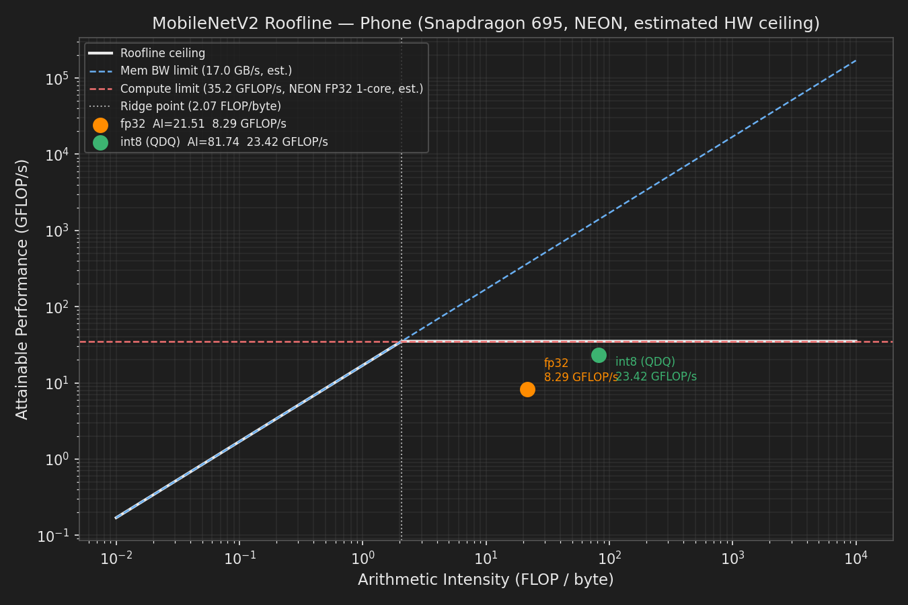

# edge-ai-bench

This project runs a small image-recognition model (MobileNetV2) on an actual
Android phone, a Samsung Galaxy A23 5G (Snapdragon 695 chip), first at full
precision, then compressed, to see how much of a difference compression
actually makes on a phone's chip.

It compares two versions of the model:

- **Full-size**: every number in the model is stored at full precision, like
  a photo saved at its original resolution.
- **Compressed**: the same model, saved with lower precision, the way you'd
  save that photo as a smaller JPEG: a little detail is lost, but the file is
  smaller and faster to open.

The interesting part is that compressing the model actually pays off here for a phone's CPU. On more powerful machines like laptops, the same compression can just as easily reduce performance. A phone's CPU doesn't have that capability, which turns out to matter a lot.

---

## Project structure

```
edge-ai-bench/
├── model.onnx                         # the exported model (full precision)
├── layer1_export/
│   └── export_model.py                # get the model
├── layer2_cpp_runner/
│   ├── main.cpp                       # benchmark code: compiled for the phone
│   ├── bench.py                       # Python benchmark version (not used below)
│   └── CMakeLists.txt                 # desktop build config (not used below)
├── layer3_quantization/
│   ├── quantize_and_compare.py        # compress it the quick way (crashes on the phone)
│   └── quantize_static.py             # compress it the careful way (works on the phone)
├── layer4_profiling/
│   ├── roofline.py                    # chart it (not used below)
│   ├── roofline_phone.py              # chart it (phone)
│   └── roofline_phone.png
└── layer5_android/
    ├── CMakeLists.txt                 # build for the phone
    └── runner_android                 # prebuilt phone binary
```

---

## What you get

Running everything below produces:

- **Timing numbers**: how many milliseconds each prediction takes on the
  phone, how much memory it uses while running, and how big the model file
  is on disk. This is done for both the full-size and compressed model.
- **A chart** plotting how close each version's real-world speed came to the
  absolute fastest the phone's chip could ever possibly go.

## How to run it

**1. Get the model.** Downloads a pretrained image-recognition model
(MobileNetV2) and saves it in a standard portable format.

```bash
python layer1_export/export_model.py
```

**2. Compress it.** There are two ways to do this, and it matters which one
you use, see "Reading the results" below for why. The quick way:

```bash
python layer3_quantization/quantize_and_compare.py --model model.onnx
```

The careful way, which is the one that actually works on the phone:

```bash
python layer3_quantization/quantize_static.py --model model.onnx --out model_int8_qdq.onnx
```

**3. Build the phone binary.** Cross-compiles the benchmark code
(`layer2_cpp_runner/main.cpp`) for Android using the NDK. A prebuilt binary
is already included at `layer5_android/runner_android` if you'd rather skip
this step.

```bash
cmake -B build-android \
      -DCMAKE_TOOLCHAIN_FILE=$NDK/build/cmake/android.toolchain.cmake \
      -DANDROID_ABI=arm64-v8a \
      -DANDROID_PLATFORM=android-29 \
      -DONNXRUNTIME_ROOT=/path/to/onnxruntime-android \
      layer5_android
cmake --build build-android
```

**4. Push it to the phone and run it,** over a USB cable:

```bash
adb push runner_android libonnxruntime.so model.onnx model_int8_qdq.onnx /data/local/tmp/
adb shell "cd /data/local/tmp && LD_LIBRARY_PATH=. ./runner_android model.onnx"
adb shell "cd /data/local/tmp && LD_LIBRARY_PATH=. ./runner_android model_int8_qdq.onnx"
```

**5. Chart the results.**

```bash
python layer4_profiling/roofline_phone.py
```

---

## Reading the results

The full-size model took about 36.2 milliseconds to make one prediction on
the phone, and used about 40 MB of memory while running.

We then tried a compressed version of the model. On this phone, it worked
well:

| | Full-size model | Compressed model |
|---|---|---|
| Speed (per prediction) | 36.2 ms | 12.8 ms |
| Memory used | ~40 MB | ~32 MB |
| Storage size | 13.3 MB | 3.5 MB |

The compressed version ran almost 3 times faster than the full-size version,
while using a bit less memory and about a quarter of the storage space.

This phone's CPU is less powerful than a laptop's, so it was working harder
just to run the full-size model. That gave the smaller, compressed version
more relative room to show its advantage. On a faster chip, the difference
wouldn't be as dramatic.

One more wrinkle: there are two different ways to compress a model, and it
mattered which one we used. Dynamic quantization compresses parts of the model on the
fly, freshly, every single time it runs. This approach doesn't run on this phone at all as the phone's software doesn't know how to unpack it, and the app crashes the moment it starts. 
The other approach is static quantization and does the compressing once, ahead of time, using some sample data as a rehearsal. This approach is the one behind the numbers above, and it's the only one that actually works here.

## Reading the chart

The chart below confirms both versions were running about as fast as this
chip is physically capable of. The slowdown wasn't from a data bottleneck,
it was the chip's raw speed limit.



One caveat: the chip's speed-limit line above is an estimate based on
publicly listed specs for the Snapdragon 695, not something measured
directly on this device.

---

## Technical details

- The Python steps (export, compression, charting) were run on Windows 11;
  the phone binary was cross-compiled with the Android NDK (r27c) and run on
  a Samsung Galaxy A23 5G over USB.
- All timings are single-threaded, so they reflect one CPU core's worth of
  speed on the phone, not the whole chip.
- Software versions: Python 3.11.3, PyTorch 2.12.0, ONNX Runtime 1.21.0 on
  the phone.
- This project doesn't yet cover longer-run effects like battery or thermal
  throttling, the phone's dedicated AI chip (many newer phones have one, and
  this benchmark doesn't use it), or multi-threaded execution.
